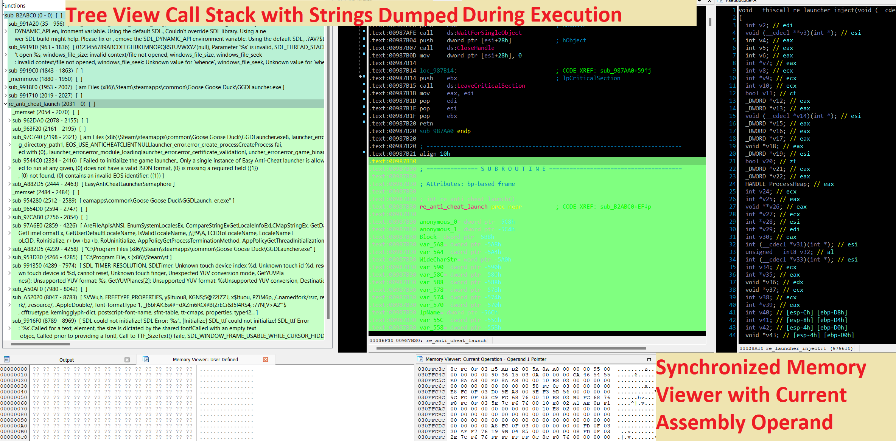

# CodexRebirth : Taint Analysis + Trace Exploration Approach to Reverse Engineering


## Introduction

The CodexRebirth project seeks to revolutionize the process of reverse engineering by introducing a Taint Analysis approach specifically designed to simplify the unraveling of **obfuscated code**. This method involves a comprehensive examination of all assembly instructions, tainting every memory address and register in the process. Subsequently, when an instruction relies on a tainted register, memory, or a result derived from these tainted elements, it will execute the operation and update the associated equations. This approach enables the user to easily trace the progression of equations and values, pinpointing the instruction responsible for any value change. Furthermore, the ability to color-code instructions based on their 'taint_id' or 'block similarity' adds an additional layer of clarity to the analysis.

*Big Thanks to Markus Gaasedelen (@gaasedelen) because I used his Tenet IDA plugin as a base for mine,  I also took a part of the code from the frinet project.*


The plugin also includes additional features, some of which have been adapted from the Tenet plugin and Frinet project, with further enhancements



Library calls are also dumped during the step tracing:


## How the tainted analysis works

The tainted analysis is based on the following principles:
- Each instruction is executed and the result is stored in a variable.
- Each variable is first tainted with a unique id.
- When an operation occurs, the result id is the concatenation of the operands ids, and the variable is updated with the result of the instruction.

By following these principles, we can easily track the forward propagation of the taints and the backward propagation of the equations.

 

Forwards propagation of the taints is represented by the green cells, and the backward propagation of the equations is represented by the pink cells. **To resume, green cells are the operation that use the current operation result, and pink cells are the operation that are used by the current operation.**

Then backward propagation can be represented as a tree. On same line are represended the operations that takes a RealValue as operand (ex: Imm operand). When a operation occurs on two SymValue, the result is a tree merge of the two operands trees.


## More Features

- **Step Tracer**: The step tracer is a standalone tool that can be used to trace the execution of a program. It can be used to any program that can be debugged with IDA. The step tracer is able to trace the execution of a program and generate a trace file that can be imported into CodexRebirth. `While, we can think that step tracing is to slow and not efficient, it has the advantage to be able to !! EXIT CODE LOOPS !!, so even a very large program can be traced.` When investigating on a trace, displaying the all the hits of a loop is not necessary, so the step tracer is a good compromise between performance and efficiency.


- **Ultimap**: Ultimap is a powerful  tool designed to assist users in pinpointing specific actions within a program, such as jumping in a video game. It operates by setting breakpoints on functions that have been pre-defined or exported by the user. When a breakpoint is triggered during program execution, Ultimap records pertinent data, allowing for precise analysis and tracking of the desired action.


## Installation

**Note: For IDA plugin, you need to have at least python 3.8 installed and IDA must be configured to use it.**


```bash
# To determine the current Python executable used by IDA, run the following command inside IDA:
import sys
print(sys.executable)
```
- Select the IDA Python 3 binary full path based on the output of the above command.


- Install required python packages by running the following command:
```bash
<python-binary-full-path> -m pip install -r requirements.txt
```


**Then copy the content of the 'plugin' folder into the IDA plugin folder.(ex: *C:\Program Files\IDA 7.6\plugins*)**


## Basic Usage For Program Analysis

- Open the IDA database of the program to analyze.
- Use step tracing to register the instructions and their results.
- Adjust the base address in the Tenet trace file, as it occasionally fails to compute correctly
- Import the trace file into CodexRebirth.
- In case the imported trace file failed to load, update base address in the trace file and re-import it. You must manually analyze the trace file to determine the correct base address to use.
- Explore by using mouse wheel while hovering the timeline, or by using previous/next buttons or shortcuts.

## Basic Usage For Shellcode Analysis
- Open the IDA database of the program to analyze.
- Use step tracing to register the instructions and their results.
- Export the shellcode region to a file.
    ```python
    import idc 
    segm_start = 0xD487000
    segm_end = 0xE86E000
    size = end - start
    filename = "D:\shellcode.bin"
    idc.savefile(filename, 0, segm_start, segm_end)
    ```
- Start a new IDA instance and open the shellcode file.
- Run this script to help IDA discover the code, you may adjust the result after running the script.
    ```python
    import idautils
    shellcode_start = 0x0D759C54
    def get_segm(seg_ea):
        for seg in idautils.Segments():
            seg_start = idc.get_segm_start(seg)
            seg_end = idc.get_segm_end(seg)
            if seg_start <= seg_ea <= seg_end:
                return seg
        raise Exception("Segment not found")

    def reset_code_segment(seg_ea, hard=True):
        seg = get_segm(seg_ea)
        seg_start = idc.get_segm_start(seg)
        seg_end = idc.get_segm_end(seg)
        seg_name = idaapi.get_segm_name(idaapi.getseg(seg))
        for addr in range(seg_start, seg_end):
            # undefined data DELIT_EXPAND del_items
            idc.del_items(addr, idc.DELIT_EXPAND)
        #print(f"Reset segment {seg_name} {hex(seg_start)}, {hex(seg_end)}")        
        # do not convert directly
        if not hard:
            return
        curr_addr = seg_start
        while curr_addr < seg_end:
            idc.create_insn(curr_addr)  
            curr_addr += idaapi.get_item_size(curr_addr)  
            
            
    print(reset_code_segment(shellcode_start hard=True))
    ```
- At the start of the tenet trace file, replace base=<0x..> by slide=<0x...>. The slide is the difference between the base address of the shellcode in IDA database and the base address of the shellcode in the original program.
- Finally Load the Trace file into CodexRebirth and start the analysis.


## Key Usage Considerations

- It's important to note that CodexRebirth currently only implements a partial set of instructions. You are encouraged to contribute by creating an issue or a pull request to expand this list.

- When debugging a program, you can do the following things to improve the performance:
    - set optimize single stepping in the debugger options.
    - set use hardware breakpoints in the debugger options.
    - disable analysis (thinking) when the debugger is attached.
    - set 'ARM_REGTRACK_MAX_XREFS' to 33072 in the ida.cfg file to avoid the 'too many xrefs' error.

- While the analysis of operations is robust, it may not be flawless. For debugging and verification purposes, CodexRebirth provides a valuable parameter: **symbolic_check**. When enabled (set to True), this feature cross-checks the results produced by the Symbolic Engine.

## Performance Insights (IDA Step Tracer)

The execution speed of The Step tracer is about 100 instructions per second on a local machine, about 35 instructions per second for a remote machine via adb, and 25 for a remote machine via windbg. However, the particularity of the step tracer is to exit code loops, so the number of instructions per second is not representative of the real performance of the tracer. 


## Tree View
**The tree representation has been removed from the plugin because generating it was too slow.** Previously it worked like this:
- Operation between RealValue and anytype of value (SymValue or RealValue) are string merged into same node
- Operation between SymValues are tree merged. 
- Even by limiting the number of tree copy, the performance was too slow.

## Future Work

- Show Thread ID with function call in the Tree view 
- Extend tenet format to include syscalls, Api calls and threads metadata while importing the trace file.
- See functions parameters in the Tree view
- Refactor file loader and create fast cache for both registers and memory
- Read children and parent reg from engines. Ex W8 -> X8 & 0xFFFFFFFF
- Refactor everything and improve taint engines instructions coverage and implementation + add more register (like Xmm)
- Switch to a more efficient ast and re-enable the equation 
- Print the equation of the current instruction in the output window.


