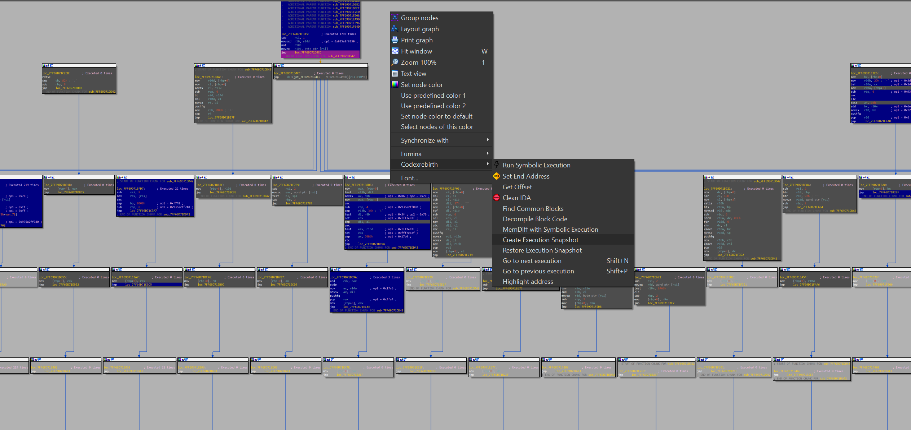

# CodexRebirth Project (DEV Branch)

### Changes from the main branch:
Refactor All Projects and Introduce Enhanced Tainting Functionality

In this commit, we've carried out a comprehensive refactoring of all projects, focusing on enhancing the engine's capabilities. The key feature introduced is a dynamic tainting mechanism that ensures that all registers and memory are consistently tainted. This change allows for a more flexible workflow in IDA, enabling users to select specific addresses and registers for tainting directly from the current instruction index.

Furthermore, this update also includes the implementation of a system for storing memory and register values. This development paves the way for seamless IDA exploration and synchronization, improving the overall user experience and efficiency.

### Introduction

The CodexRebirth project aims to simplify the reverse engineering of obfuscated methods using a Taint Analysis approach. It will analyze all assembly instructions and, when one depends on a tainted register or memory, or on a result derived from one of these tainted values, it will process the operation and update the relevant equations.

With the IDA plugin, the program segments are automatically mapped in qiling, so you will have a exact copy of the program in memory. The plugin will then automatically set the registers and memory to the values of the registers and memory at the beginning of the function to analyze. It will then execute the function and analyze the instructions one by one. After that you can navigate through the results. 


#### IDA Plugin Result View:

- in pink: the instructions with operations that depend on tainted values or the current instruction pointer
- in grey: the instructions that seems to be generated by a obfuscation tool
- in blue: the instructions that have been executed
- in default color: the instructions that have not been executed

As you can see, the plugin also displays operands values and the equations generated by the analysis.
You can navigate through the results using mouse scroll while hovering the timeline one the right side of the disassembly window (not shown in the screenshot).




#### Command Line Result View:


**If you are looking at this project out of curiosity, I suggest trying to understand the algorithm protected by Tigress in the `examples/tigress/src-tigress-protected` directory, or even better, attempting to do so from the compiled version. The purpose of this project is precisely to combat this kind of protection.**

CodexRebirth has two modes of operation:

- Command line
- IDA Plugin 

*Big Thanks to Markus Gaasedelen (@gaasedelen) because I used his Tenet IDA plugin as a base for mine*

Using the IDA plugin is recommended as it greatly facilitates the analysis setup and allows for more efficient result examination. It helps navigate effectively to trace the path.

## INSTALLATION

**Note: For IDA plugin, you need to have at least python 3.8 installed and IDA must be configured to use it.**

- After python 3.8 is installed, you need run idapyswitch to python 3.8.10, then install setuptools and wheel.
- After that, you can install the CodexRebirth plugin by using python 3.8.10 binary full path (ex: *C:\Users\antoi\AppData\Local\Programs\Python\Python38\python.exe*)


Command line installation for the CodexRebirth library:
```bash
git clone git@github.com:AntoineBlaud/TheCodexRebirth.git
cd TheCodexRebirth/src
python3 setup.py sdist bdist_wheel 
pip3 install . 
```


## USAGE (Command Line)


Check the examples in this order:

- examples/fairlight
- examples/tigress/siphash24
- examples/tigress/mix2, examples of variable destruction
- examples/tigress/indirect_load, an example of indirect variable loading
- examples/tigress/sample14, long string input of size 48, function is not obfuscated


## USAGE (IDA Plugin)

- Open the IDA database of the program to analyze.
- Write a controller file likes the ones in the `examples/ida_plugin` directory.
- Start debugging mode and stop the execution of the program at the beginning of the function to analyze.
- Open the CodexRebirth context menu and select 'Run Symbolic Execution'.
- Wait for the analysis to finish.
- Explore by using mouse wheel while hovering the timeline, or by using previous/next buttons or shortcuts.
- You also have the possibility highlight the current instruction to show all occurences in the timeline 
## Key Points for Usage

- Note that only a portion of the instructions is implemented; you can create an issue or a pull request to add more.

- The analysis of operations may not be perfect; therefore, for debugging and verification, CodexRebirth provides two parameters:
  - `strict_symbolic_check` -> If set to True, the program will stop as soon as an error is detected, allowing for investigation.
  - `symbolic_check` -> Removes tainted values that do not correspond to memory values (which may cause certain details to be missed).

- Having `symbolic_check` disabled allow to speed up execution to 2500 instructions per second instead of 340 (metrics obtained with Python 3.11 and a CPU Ryzen 5900HX 3.3GHz-4.6GHz)

- The CodexRebirth library is slower when running in IDA. According to the tests, it's **5 times slower** than on my WSL instance. 

- For memory strings, you should use `taint_memory` with a byte step size of 1 or `sizeof(int)` depending on their usage. If the string is read by moving 4 or 8 bytes at a time, and you set the memory step size to 1, it will not work correctly. Have a look on the `examples/ida_plugin/controller_template.py` function `taint_memory_with_string` for a good starting point.

- If you find `addrof` in your results, it means that the script contains operations similar to those in the `indirect_load.c` file.

## What to do next?
- Refactor the code to make it more readable and maintainable (I implemented to much things in a short time, so the code is not very clean)
